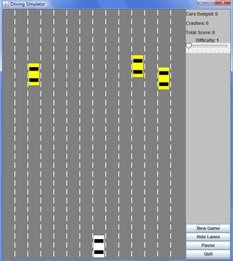
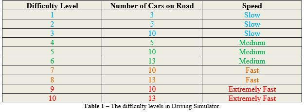
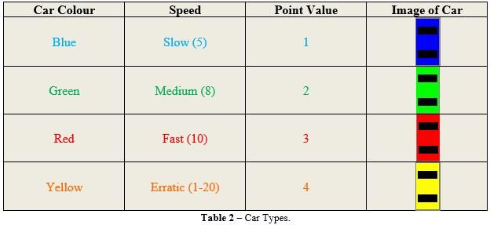
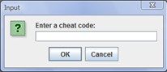
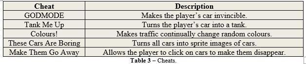

# Driving Simulator Java
 
Developed with BlueJ in 2009, this game is controlled with the mouse, has cheat codes to swap to using sprites.

## 1 Starting the Program

Launch the game using Driver.java.

## 2 The Aim of the Game

The aim of this game is to dodge oncoming cars to score points. Each differently coloured car has a different speed and point value. Higher level difficulties will award more points for each car that is dodged while at the same time making it more difficult to dodge the oncoming cars. Points for dodging cars are awarded once each car has left the screen.

## 3 The Game Window

When the game is first opened, something similar to the image below should appear. This is the main game window and contains all of the controls that can be used in the game. On the right at the top, is text showing the player’s current score in terms of the number of cars dodged and the total score, as well as, the number of crashes. Below which, is a slider which can be used to change the difficulty. When the slider is changed the game will be paused and the New Game should be pressed to start a new game with the specified difficulty.

The buttons on the lower right provide additional functionality. Pressing the New Game button will start a new game with the currently selected difficulty. Pressing the Hide Lanes button will hide the lane lines in the game. Pressing the Show Lanes button will make them reappear. The Pause button will pause the game, and pressing Play Game will resume the game. Finally, Quit will prompt the player to confirm if they want to quit; for which confirming Yes will close the game.

## 4 Controlling your Car

The white car is the player’s car; to control the car the mouse is used. To start controlling the player car the left mouse button needs to be clicked and held down on the car. Dragging the mouse left and right will result in the car also moving left and right. The car will automatically centre horizontally on the mouse cursor to make it easier to control.

Make sure not to move the mouse cursor too far up or down from the car or you will lose control. To resume control of the car simply click and hold the left mouse button on the car again.

If at any time you want to stop controlling the motion of the car, simply release the left mouse button and it will remain fixed in the place it has been moved to. This will allow temporary stopping to interact with the game’s buttons or difficulty slider if required.

If you do crash, a prompt will appear asking if you would like to resume with a new car. Clicking Yes will start a new round of the game, and clicking No or Cancel will exit the game.

## 5 Outline of Difficulty Levels and Car Types

### 5.1 Difficulty Levels

Changing the difficulty level will change the number of cars on the road and the speed of that the cars move down the road with (each type of car also has their own specific speed as shown in section 5.2). Table 1 below, shows the number of cars and speed that are on the 10 different difficulty levels.

### 5.2 Car Types

Each car has a colour, a speed and a point value. When scoring the point value of the car is multiplied by the difficulty level and is added to your total score. Below in Table 2 is a comparison of the colours of cars; showing their individual: speeds, point values and an example image of each.

## 6 Cheats

In this game there are a number of cheats that can be used. To access the cheat dialog box press C, and the box shown in Figure 3 will appear.

Cheats can be entered into the textbox and pressing enter or clicking the OK button will activate the cheat. The cheats are case sensitive and when the same cheat is entered multiple times it will toggle whether the cheat is active or not. The cheats that can be entered are shown and described in Table 3 below. If a cheat has been entered incorrectly a message will appear indicating so.

An important thing to note is that the “Colours!” cheat will not show if “These Cars Are Boring” is active. And also if “Tank Me Up” is active it will always show the player as a tank (until the cheat has been disabled) which will hide the player’s car from “These Cars Are Boring”.

## 7 Credits

Code and Documentation by Peter Mitchell

Basic sprites for cheats were collected from:

Harbour J. 2005, Tank Sprite, viewed 8/10/2009,
<http://www.emunix.emich.edu/~evett/GameProgramming/allegro_howTo.html>

Neoseeker Forums, Car Sprites, viewed 8/10/2009,
<http://www.neoseeker.com/forums/22121/t938316-car-charset/>

Remaining Sprites (Green and Blue cars) were adapted from the above by Amish Coelho.

